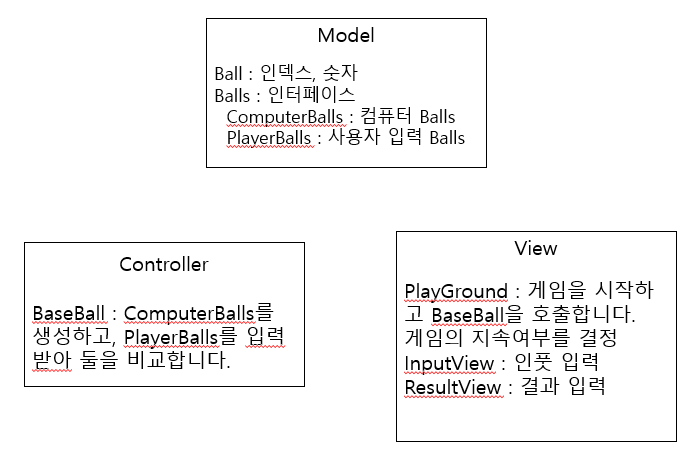

프로젝트 설계 방식
======

1. TDD로 접근하는데 있어서는 Ball과 Balls를 테스트하면서 설계했습니다.
2. Scanner를 쓰기 시작하는 부분은 제외하다 보니 실제 비교가 이뤄지는부분은 어려웠어요
3. 만들어진 Ball, Balls를 이용해서 MVC패턴을 생각하며 설계 했습니다

---------
### MVC 패턴의 적용
먼저 패키지를 Model, Controller, View로 나눠서 
기존의 만들어둔 클래스들을 각각 목적에 맞는 패키지에 넣었습니다.

모델에서는 Ball, Balls 처럼 모델과 관련된 메소드들만

컨트롤러 에서는 BaseBall이 진행되며 값을 비교하고 성공을 비교하는 메소드들

뷰에선 입력,출력 게임의 지속진행 여부를 뭍어보는 메소드들

이렇게 구성하려 최대한 분리해 봤습니다.

-------
### 전체 로직 설명

1. Playground의 playGame 호출
    1. PlayGround는 게임의 지속 여부를 가지고 있습니다. 
    2. 지속여부가 CONTINUE라면 playbaseball메서드를 통해 baseball 인스턴스를 생성하면서 야구게임을 실행합니다.
2. BaseBall 인스턴스와 playBall
    1. BaseBall이 인스턴스화 하면서 ComputerBalls도 인스턴스화 합니다.
    2. PlayerBalls를 인스턴스화 하고 입력을 받습니다.
    3. BaseBall의 메서드인 getBallCount, getStrikeCount를 통해 결과를 출력합니다.
    4. 결과가 3strike면 반복을 종료합니다.
3. ComputerBallr과 PlayerBall
   1. 두 클래스는 비슷한 역할을 하고 생성 방식만 달라 interface를 통해 생성 방식을 나눴습니다.
   2. computerBall 클래스는 숫자를 랜덤, playerBall은 입력받아 숫자를 생성합니다.
      
3. BaseBall이 끝났으면 PlayGround에서 지속여부 확인
   1. PlayGound에서 게임 지속 여부를 확인합니다.
   2. 입력이 2면 게임 끝!

