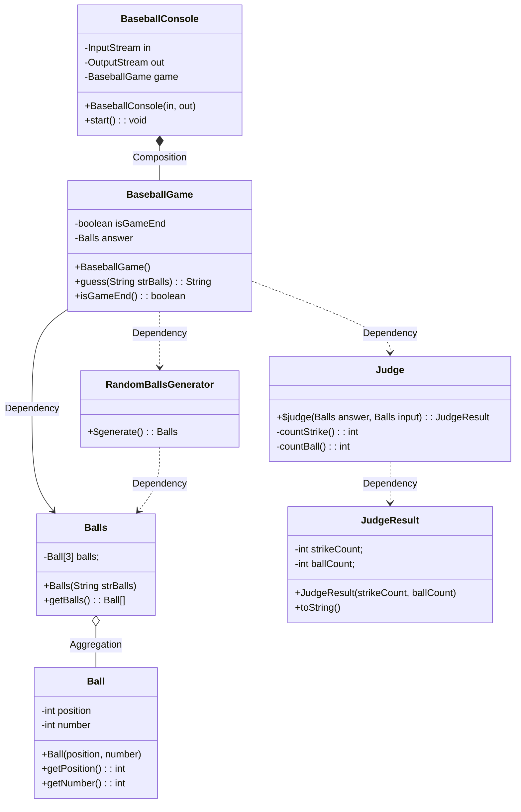

# 자바 플레이그라운드 - 숫자야구 미션

> 강의 링크: [https://edu.nextstep.camp/c/9WPRB0ys/](https://edu.nextstep.camp/c/9WPRB0ys/)

* 위 NEXTSTEP 강의 내용을 바탕으로 5명이 같이 미션을 진행하고 코드리뷰 및 스터디하는 용도로 만들어진 저장소입니다.
* 패스트캠퍼스 야놀자 테크스쿨 스터디 그룹 10조 '맞왜틀'팀 - 서원빈, 김종훈, 김진홍, 고동훤, 노재혁

## 요구사항 목록

- [x] number와 position이 서로 중복되지 않는 Balls(Ball[3])를 만든다.
- [ ] 정답과 사용자 입력을 비교하여 스트라이크, 볼, 낫싱의 결과를 반환한다.
- [ ] 사용자의 추측을 입력 받고 추측 결과를 출력한다. 게임이 종료될 때까지 반복한다.

## 클래스 다이어그램

